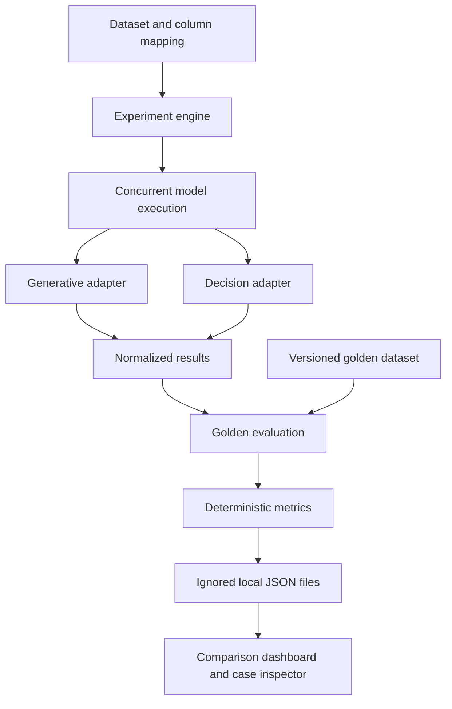

# OpenRouter Model Evaluation Kit

Open-source model evaluation lab for benchmarking LLMs and decision models across accuracy, latency, tokens and inference cost.

## Status
Local pilot with Next.js, CSV/XLSX import, model selection, real OpenRouter execution, versioned golden comparison and downloadable results. No PostgreSQL, Supabase or Docker is required. Missing measurements remain **NOT MEASURED YET**.

## Run the foundation
Node.js 22+ and Git are required. Clone https://github.com/guiritaro19/openrouter-model-eval and install dependencies. The committed pnpm lockfile records the tested dependency versions.

```powershell
npm install
Copy-Item .env.example .env.local # only if no local configuration exists
# Set OPENROUTER_API_KEY in .env.local using your local editor.
npm run dev
```

Open http://127.0.0.1:3000. For a compiled server, run `npm run build`, then `npm start`. Restart after changing credentials. Never paste keys into chat, commit them, export them in Postman or expose them in a frontend. OPENROUTER_API_KEY powers all OpenRouter candidates; other env variables are optional reserved fields, not required integrations.

## Try the pilot

1. Load the 100 fictional GTM cases or import CSV/XLSX (first worksheet; max 2 MB).
2. Select the ID column and input columns. Unselected fields stay out of the prompt.
3. Edit context, task and one `LABEL: definition` per allowed output.
4. Review the catalog-derived candidate presets; change any selection (max 4 models).
5. Test only the first case before running a full paid batch.
6. Inspect real outputs, latency, tokens and cost.
7. Import the golden file after execution; select its ID and expected-answer columns.
8. Download XLSX with Inputs, Model results, Comparison, Golden and Experiment tabs. Full JSON includes raw metadata.

Model calls consume OpenRouter credits. Importing golden answers, calculating comparisons and exporting existing results make no inference calls. Every golden import appends a version. Request IDs must be unique and nonempty; store XLSX IDs as text to retain leading zeros. Partial golden coverage is explicit; unknown/duplicate IDs and invalid labels are rejected. Golden files use `id,expected,notes` or equivalent mapped columns.

## Local files and evaluation

Each run creates its own JSON in ignored `results/`. Completed calls are saved incrementally using temporary-file rename. Preserve one server process per project; the pilot supports one active batch. Browser disconnects do not intentionally cancel backend persistence. After a process crash, a saved running record is incomplete; automatic resume is not implemented.

Each record includes dataset hash, mapping, canonical input, prompt version, requested/resolved model, pricing snapshot, usage, raw bodies and timing. Up to four calls run concurrently with bounded retries and timeouts. Jev uses typed Decisions questions and retains returned probabilities; generative confidence stays null.

Accuracy is correct / completed golden-matched requests, including invalid/error requests in that denominator. Pairwise agreement uses successful responses only. Latency includes retry wait; P50/P95/P99 use interpolation. Reported usage/cost takes priority. Missing totals remain unavailable; restricted pricing estimates are labeled. Empty spreadsheet cells mean unavailable, never zero. Fictional rule-authored labels are teaching data, not external performance evidence.

## Checks

```powershell
npm test
npm run typecheck
npm run build
npm run security:check
```

Tests cover CSV/XLSX, leading zeros, duplicate headers/IDs, golden matching and coverage, accuracy with failures, agreement, percentiles, provider usage/cost, decision probabilities, shared semantic inputs and secret scanning.

## Request inspection
Import collections/openrouter.postman_collection.json. Set the key only in a local secret variable. Run list_openrouter_models and choose current IDs with text input. Choose a text output model for chat; structured output requires compatible supported parameters. Choose a decisions output model for Jev. Model IDs intentionally start empty. POST requests can incur inference costs. For chat usage lookup, copy the real response id to GENERATION_ID. Decisions usage is returned directly in its response; do not assume the chat generation lookup supports it.

The collection is the Phase 0 fallback for Postman Lite MCP, which was not found in the connected tools or local MCP configuration. The production app will never depend on Postman. A later stdio MCP can expose the same six operations via a shared server-side adapter, with schema validation, redaction and no secrets in tool arguments.

## Planned architecture

The basic workflow above is implemented. LangGraph and Langfuse are future layers. Enum classification is supported; semantic judges, human review, Pareto charts, routing policies and durable resumption are not yet implemented.

## Security and reproducibility
Env files, local results and private-data are ignored. The server binds to 127.0.0.1, rejects non-local hosts/cross-origin calls and redacts configured credentials in persisted bodies. It has no multi-user authentication: keep it local. The scanner checks the Git index and every reachable commit for common credentials and env files. It cannot recognize every secret or determine whether a dataset is private; manual review remains required. Do not push if the scan fails or review finds personal data. Model pricing is snapshotted per run.

## Roadmap
0. Foundation, collection, authenticated health and public GitHub repository.
1. Next.js, local files, CSV/XLSX mapping and experiment context.
2. Dynamic model selection, generative/decision adapters and one-row validation.
3. Bounded execution, retries, timeouts, real usage/cost and local persistence.
4. Versioned golden data, accuracy, agreement, result explorer and XLSX export.
5. Semantic judge, independent evaluations and append-only human review.
6. Real LangGraph orchestration and official visualization setup.
7. Langfuse traces.
8. Pareto frontier and model economics.
9. Fictional 100-row demo, documentation, publication and deployment.

See docs/phase-0.md for evidence, API references and publication commands.

## License

MIT. See LICENSE.
