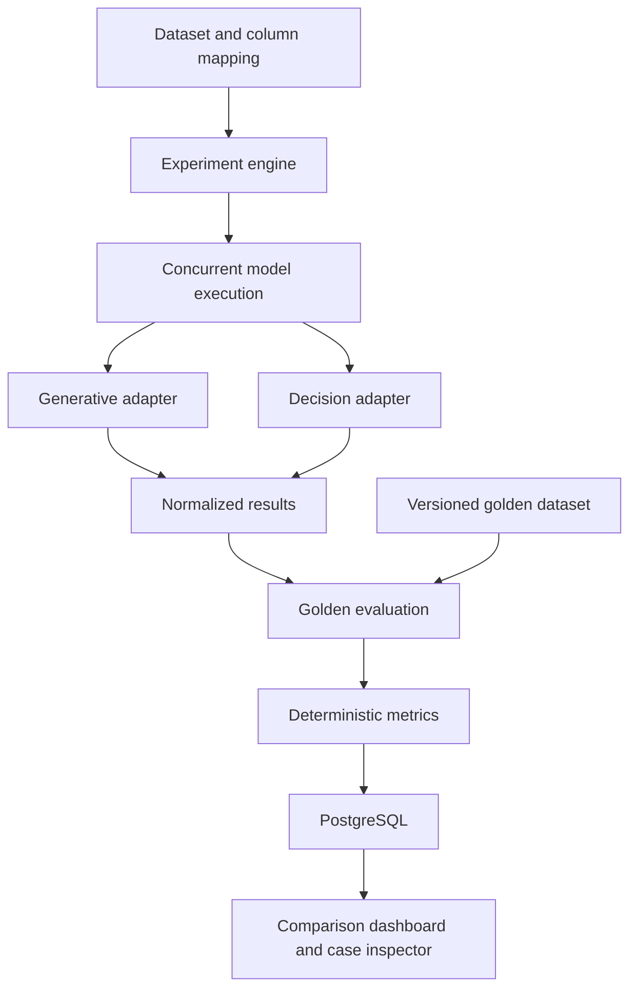

# OpenRouter Model Evaluation Kit

Open-source model evaluation lab for benchmarking LLMs and decision models across accuracy, latency, tokens and inference cost.

## Status
Phase 0 foundation only. No application UI, database, model runner or benchmark exists yet. Accuracy, latency, tokens, costs and model outputs: **NOT MEASURED YET**.

## Run the foundation
Node.js 22+ and Git are required. There are no third-party dependencies at this stage.

```powershell
Copy-Item .env.example .env.local # only if no local configuration exists
node --test tests/security.test.mjs
node --env-file=.env.local scripts/openrouter-health.mjs
# After adding your key locally, verify authentication without inference:
node --env-file=.env.local scripts/openrouter-health.mjs --auth
node scripts/security-check.mjs
```

The public catalog check makes no model call. Authentication is checked separately. Never paste keys into chat, commit them, export them in Postman or expose them in a frontend. OPENROUTER_API_KEY is the primary credential; OPENAI_API_KEY is reserved for a future optional direct adapter. Other env variables are reserved for later phases; all template values are empty.

## Request inspection
Import collections/openrouter.postman_collection.json. Set the key only in a local secret variable. Run list_openrouter_models and choose current IDs with text input. Choose a text output model for chat; structured output requires compatible supported parameters. Choose a decisions output model for Jev. Model IDs intentionally start empty. POST requests can incur inference costs. For chat usage lookup, copy the real response id to GENERATION_ID. Decisions usage is returned directly in its response; do not assume the chat generation lookup supports it.

The collection is the Phase 0 fallback for Postman Lite MCP, which was not found in the connected tools or local MCP configuration. The production app will never depend on Postman. A later stdio MCP can expose the same six operations via a shared server-side adapter, with schema validation, redaction and no secrets in tool arguments.

## Planned architecture

LangGraph and Langfuse will be introduced after the basic workflow works. The graph above is a plan, not an implemented workflow.

## Security and reproducibility
Env files, local results and private-data are ignored. The scanner checks the Git index and every reachable commit for common credentials and env files. It cannot recognize every secret or determine whether a dataset is private; manual review remains required. Do not push if the scan fails or review finds personal data. Catalog pricing must be snapshotted per future run; unavailable measurements must remain null. Preserve dataset, prompt, golden and judge versions.

## Roadmap
0. Foundation, collection, public catalog check; authenticated check and GitHub publication pending.
1. Next.js, PostgreSQL, CSV/XLSX upload, mapping and experiment context.
2. Dynamic model selection, generative/decision adapters and one-row validation.
3. Bounded batch concurrency, retries, timeouts, real timing/usage/cost and persistence.
4. Versioned golden data, accuracy, agreement, result explorer and comparison.
5. Semantic judge, independent evaluations and append-only human review.
6. Real LangGraph orchestration and official visualization setup.
7. Langfuse traces.
8. Pareto frontier and model economics.
9. Fictional 100-row demo, documentation, publication and deployment.

See docs/phase-0.md for evidence, API references and publication commands.
